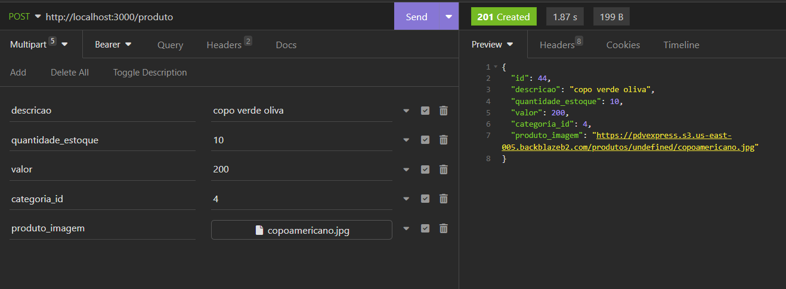

# **PDV Express** :desktop_computer::shopping_cart::shopping::moneybag:

Este projeto foi implementado no formato de desafio final para aprovação no curso de Desenvolvimento de Software com foco em Back-end ofertado pela Cubos Academy por meio da parceria com o Potência Tech - iFood.

## **Descrição do desafio**

Construímos uma RESTful API para Pontos de Venda :moneybag:  
As funcionalidades disponíveis são:

- Cadastrar Usuário
- Fazer Login
- Detalhar Perfil do Usuário Logado
- Editar Perfil do Usuário Logado
- Listar categorias
- Cadastrar Produto
- Editar dados do Produto
- Listar Produtos
- Detalhar Produto
- Excluir Produto por ID
- Cadastrar Cliente
- Editar dados do Cliente
- Listar Clientes
- Detalhar Cliente
- Cadastrar Pedidos
- Listar Pedidos

## **Deploy**

O PDV Express foi implantado via Cyclic e pode ser acessado [por aqui](https://perfect-plum-pronghorn.cyclic.app/).

<details><summary>

## **Requisitos**

</summary>

<details><summary>  
  
  ### Rodando localmente  
</summary>

- Nodejs instalado.
- Banco de Dados Postgres.
- Beekeeper Studio para, caso queira, interação com o banco de dados.
- Criação de banco de dados e disponibilização de suas informações em arquivo de variáveis de ambiente `.env` de acordo com o `.env.example`. Além disso, é preciso disponibilizar também a porta para comunicação e a senha de validação de token.
- Criar tabelas por meio do `query.sql`.
- Insomnia para testes de rotas seguindo o passo a passo disponibilizado para os mesmos.

</details>

<details><summary>  
  
  ### Rodando via Deploy  
</summary>

- Insomnia para testes de rotas seguindo o passo a passo disponibilizado para os mesmos.
</details>  
</details>  
<details><summary>

## **Teste de funcionalidades**

</summary>  
<details><summary>  
  
### Rodando localmente:  
</summary>

1. Clone o projeto:

```bash
git clone https://github.com/Daian4/PDVExpress.git
```

2. Abrir a pasta do projeto:

```bash
cd PDVExpress
```

4. Instalar dependências:

```bash
npm install
```

5. Inicializar o servidor:

```bash
npm run start
```

Localmente, a aplicação estará disponível no endereço local: `http://localhost:3000`, caso a porta disponibilizada no `.env` seja a 3000 e poderá ser testada no insomnia normalmente apenas adicionando as rotas ao endereço mencionado, como no exemplo:


</details>  
<details><summary>  
  
### Rodando via deploy
</summary>  
É possível realizar o teste das funcionalidades por meio do Insomnia e fazer uso das rotas. Para isso, basta importar o arquivo `rotasInsomnia_PDVExpress` no Insomnia.  
Ao utilizar o link do deploy, coloque-o da seguinte forma e em seguida faça uso das rotas que serão explicadas no tópico de Funcionalidades. No exemplo, foi feito uso da rota `/categoria`.  
  
</details>  
</details>
<details><summary>

## Funcionalidades

</summary>

<details><summary>

### Cadastrar usuário

</summary>

#### `POST` `/usuario`

Essa é a rota que será utilizada para cadastrar um novo usuario no sistema.

- **Requisição**  
 O corpo (body) deverá possuir um objeto com as propriedades mostradas na imagem. O retorno desta requisição, em caso de sucesso, exibirá os dados de entrada (exceto a senha) junto ao ID do usuário.  

</details>

<details><summary>

### Login do usuário

</summary>

#### `POST` `/login`

Essa é a rota que permite o usuario cadastrado realizar o login no sistema.

- **Requisição e Resposta**  
 O corpo (body) deverá possuir um objeto com as seguintes propriedades (respeitando estes nomes). O retorno desta requisição, em caso de sucesso, exibirá os dados do usuário junto ao seu token de acesso às demais funcionalidades.  

</details>  
<details><summary>

### Como utilizar o token de acesso

</summary>  
O token de acesso para as demais funcionalidades deve ser disponibilizado no header com o formato Bearer Token. No Insomnia, será da seguinte forma: 
  
Quando enviado, o token é validado e também verificado qual usuário do banco está vinculado ao mesmo pelo ID.  
</details>  
<details><summary>

### Detalhar usuário

</summary>

#### `GET` `/usuario`

Essa é a rota para quando o usuario quiser obter os dados do seu próprio perfil.  
**Atenção:** Certificar-se de que o token de autenticação está sendo enviado.

- **Requisição e Resposta**  
Neste caso, não deverá possuir conteúdo no corpo da requisição.  
Para esta funcionalidade, a resposta em caso de sucesso apresentará os dados do usuário com exceção de sua senha.  

</details> 
<details><summary>

### Atualizar usuário

</summary>

#### `PUT` `/usuario`

Essa é a rota para quando o usuário quiser realizar alterações no seu próprio usuário.  
**Atenção:** Certificar-se de que o token de autenticação está sendo enviado.

- **Requisição e Resposta**
O corpo (body) deverá possuir um objeto contendo os novos dados de nome, email e senha. Nesta funcionalidade é certificado se o email informado já está cadastrado e por consequência não possa ser utilizado. Então, é enviado uma mensagem informando esta ocorrência. Em caso de sucesso, nenhuma mensagem é enviada.  

</details> 
<details><summary>

### Listar categorias

</summary>

#### `GET` `/categoria`

Essa é a rota para quando o usuario logado quiser listar todas as categorias cadastradas para consulta.  
**Atenção:** Certificar-se de que o token de autenticação está sendo enviado.

- **Requisição**  
 Não é necessária nenhuma informação além do token de autenticação.  
 Como resposta, as categorias são exibidas em formato de array de objetos, tendo cada categoria o seu próprio ID de referência.

</details>  
<details><summary>

### Cadastrar Produto

</summary>

#### `POST` `/produto`

Essa é a rota que será utilizada para cadastrar um novo produto no sistema.
**Atenção:** Certificar-se de que o token de autenticação está sendo enviado.

- **Requisição**  
 O corpo (body) deverá possuir um objeto com as propriedades mostradas na imagem. No body, é selecionado a estrutura de Multipart Form, permitindo que, caso queira, o usuário cadastre junto ao produto, uma imagem do mesmo. O retorno desta requisição, em caso de sucesso, exibirá os dados de entrada junto ao ID do produto.  

</details>  
<details><summary>

### Editar dados do produto

</summary>

#### `PUT` `/produto/:id`

Essa é a rota para quando o usuario logado quiser atualizar as infromações de um produto cadastrado.
**Atenção:** Certificar-se de que o token de autenticação está sendo enviado.

- **Requisição**  
 O corpo (body) deverá possuir um objeto com as propriedades mostradas na imagem. Deverá ser enviado o ID do produto a ser editado como parâmetro de rota do endpoint como pode ser visto abaixo. O retorno desta requisição, para caso de sucesso, será a mensagem de que o produto foi atualizado.

</details>  
<details><summary>

### Listar Produtos

</summary>

#### `GET` `/produto`

Essa é a rota que deverá ser usada para quando o usuário logado quiser listar todos os produtos cadastrados.
**Atenção:** Certificar-se de que o token de autenticação está sendo enviado.

- **Requisição**  
 Não é necessário nenhum objeto no corpo da requisição. Porém, é preciso incluir um parâmetro do tipo query `categoria_id` para que seja possível consultar produtos por categorias. Então, caso informado, os produtos serão filtrados de acordo com o id de uma categoria. Se não enviado nenhum filtro como query, serão listados todos os produtos cadastrados.

</details>  
<details><summary>

### Detalhar Produto

</summary>

#### `GET` `/produto/:id`

Essa é a rota que deverá ser acessada para quando o usuário logado obter um de seus produtos cadastrados.
**Atenção:** Certificar-se de que o token de autenticação está sendo enviado.

- **Requisição**
Deverá ser enviado o ID do produto a ser editado como parâmetro de rota do endpoint como pode ser visto abaixo. Como resposta, as categorias são exibidas em formato de array de objetos, tendo cada categoria o seu próprio ID de referência. O retorno desta requisição, em caso de sucesso, exibirá todos os dados do produto.

</details>  
<details><summary>

### Excluir Produto por ID

</summary>

#### `DELETE` `/produto/:id`

Essa é a rota que deverá ser utilizada para quando o usuário logado quiser excluir um de seus produtos cadastrados. Não será permitida a exclusão de produto que tenha sido registrado em algum pedido.
**Atenção:** Certificar-se de que o token de autenticação está sendo enviado.

- **Requisição**  
Deverá ser enviado o ID do produto a ser editado como parâmetro de rota do endpoint como pode ser visto abaixo. O retorno desta requisição, para caso de sucesso, será a mensagem de que o produto foi excluído.

</details> 
<details><summary>

### Cadastrar Cliente

</summary>

#### `POST ` `/cliente`

Essa é a rota que será utilizada para cadastrar um novo produto no sistema.
**Atenção:** Certificar-se de que o token de autenticação está sendo enviado.

- **Requisição**  
O corpo (body) deverá possuir um objeto com, no mínimo, as propriedades de nome, email e CPF. As demais informações não são obrigatórias e, portanto, não precisam necessariamente fazer parte do corpo da requisição. O retorno desta requisição, em caso de sucesso, exibirá os dados de entrada junto ao ID do cliente.

</details>  
<details><summary>

### Editar dados do cliente

</summary>

#### `PUT` `/cliente/:id`

Essa é a rota que será utilizada a fim de permitir que o usuário consiga realizar atualização de um cliente cadastrado.
**Atenção:** Certificar-se de que o token de autenticação está sendo enviado.

- **Requisição**  
O corpo (body) deverá possuir um objeto com, no mínimo, as propriedades de nome, email e CPF. As demais informações não são obrigatórias e, portanto, não precisam necessariamente fazer parte do corpo da requisição. Atentar-se em enviar o ID do cliente a ser editado como parâmetro de rota do endpoint como pode ser visto abaixo. O retorno desta requisição, em caso de sucesso, exibirá uma mensagem informando que o cliente foi atualizado.

</details>  
<details><summary>

### Listar Clientes

</summary>

#### `GET` `/cliente`

Essa é a rota que será chamada para quando o usuário logado quiser listar todos os clientes cadastrados.
**Atenção:** Certificar-se de que o token de autenticação está sendo enviado.

- **Requisição**  
 Não é necessária nenhuma informação além do token de autenticação.  
 Como resposta, serão listados todos os clientes cadastrados.

</details> 
<details><summary>

### Detalhar Cliente

</summary>

#### `GET` `/cliente/:id`

Essa é a rota para quando o usuário logado quiser obter um de seus clientes cadastrados.
**Atenção:** Certificar-se de que o token de autenticação está sendo enviado.

- **Requisição**  
Deverá ser enviado o ID do cliente procurado como parâmetro de rota do endpoint como pode ser visto abaixo.  
 Como resposta, em caso da existência do cliente buscado, serão exibidos os dados do cliente.

</details> 

<details><summary>

### Cadastrar Pedido

</summary>

#### `POST` `/pedido`

Essa é a rota que será utilizada para cadastrar um novo pedido no sistema.  
**Atenção:** Certificar-se de que o token de autenticação está sendo enviado.

- **Requisição**  
  É necessário que o pedido contenha, pelo menos, um produto vinculado. O corpo (body) deverá conter um objeto com as propriedades: cliente_id, observação (opcional) e pedido_produtos, que será um array de objetos com as propriedades: produto_id e quantidade_produto. O retorno desta requisição, em caso de sucesso, exibirá uma mensagem informando que o pedido foi cadastrado com sucesso.  
  **Atenção:** o pedido somente será cadastrado se todos os produtos estiverem validados.  

</details> 

<details><summary>

### Listar Pedido

</summary>

#### `GET` `/pedido`

Essa é a rota que será chamada quando o usuário logado quiser listar todos os pedidos cadastrados.  
**Atenção:** Certificar-se de que o token de autenticação está sendo enviado.

- **Requisição**  
  É necessária a inclusão de um parâmetro do tipo query `cliente_id` para que seja possível consultar pedidos por cliente. O retorno desta requisição, em caso de sucesso, exibirá um array com todos os pedidos cadastrados e, caso tenha passado a query, todos os pedidos cadastrados para o cliente específico.

</details> 

</details>

---  

## ✒️ Autoras

[Bianca Aparecida](https://github.com/biancaaparecida07)  
[Daiana Lima](https://github.com/Daian4)  
[Caroline Morais](https://github.com/CNakamura20)  
[Mariana Olaya](https://github.com/mariolayal)  
[Laís Oliveira](https://github.com/laisfrr)
